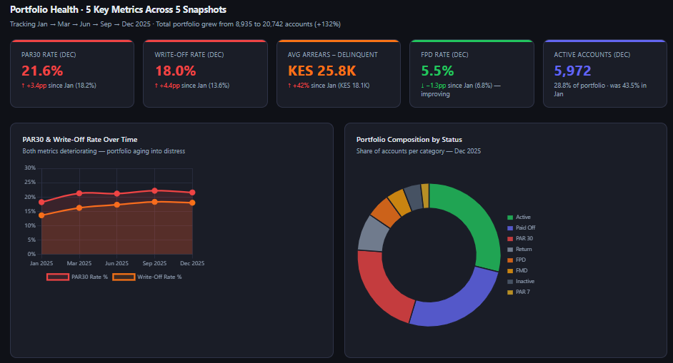
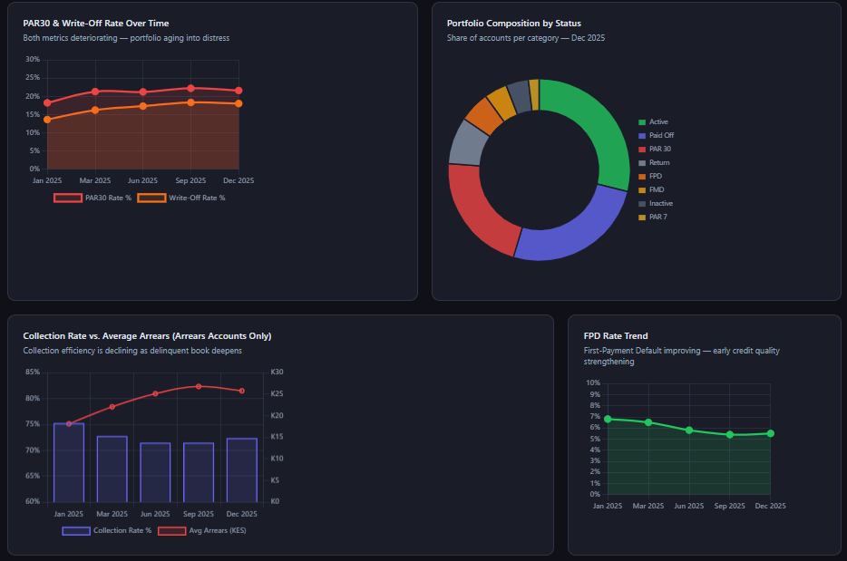
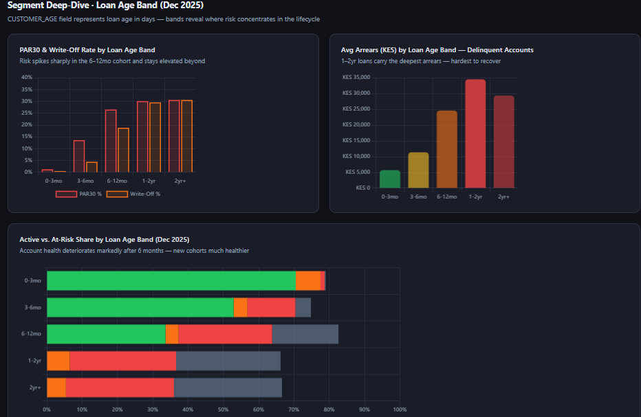
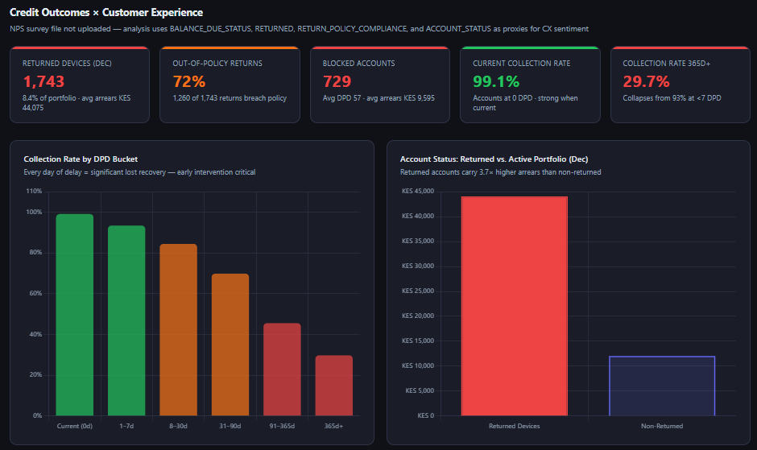
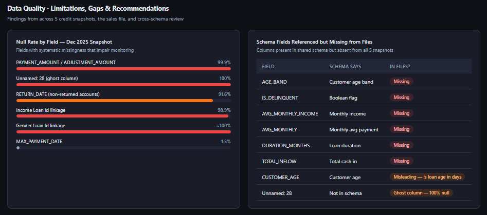

# Interactive MoPhones Credit Dashboard

The dashboard aims to transform raw operational data into actionable insights, enabling better monitoring of credit performance, improved operational efficiency, and stronger data governance.

Key Focus Areas

1. Portfolio Health
Analyse overall portfolio performance using key metrics such as repayment behavior, arrears trends, and write-off rates. This section helps identify early warning signs of credit risk and track the stability of the loan book over time.

2. Credit × Experience
Explore how customer experience and credit performance intersect. This includes understanding how different customer segments behave, identifying patterns in repayment based on tenure or engagement, and uncovering opportunities to improve both customer outcomes and credit quality.

3. Data Quality Issues
Highlight gaps, inconsistencies, and missing values within the dataset. This section supports efforts to improve data reliability, ensuring that insights and decisions are based on accurate and complete information.

## The Visuals

  

 

 

